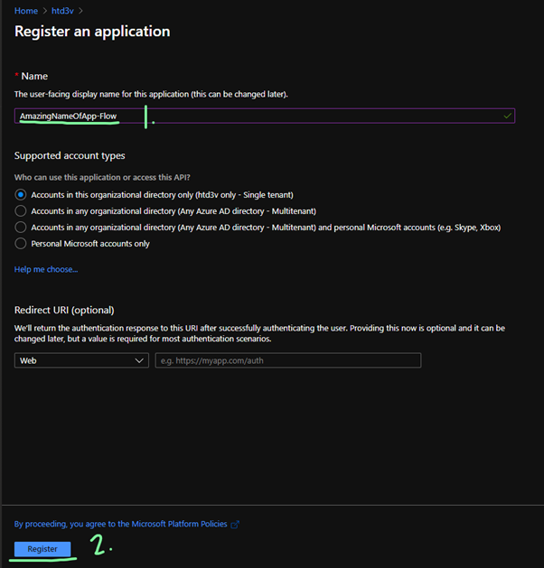
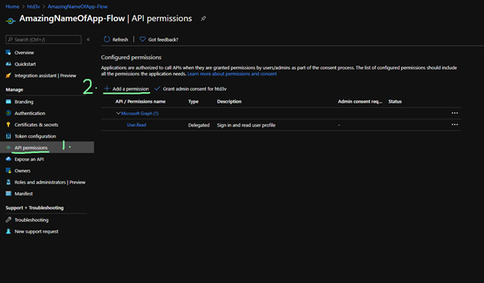
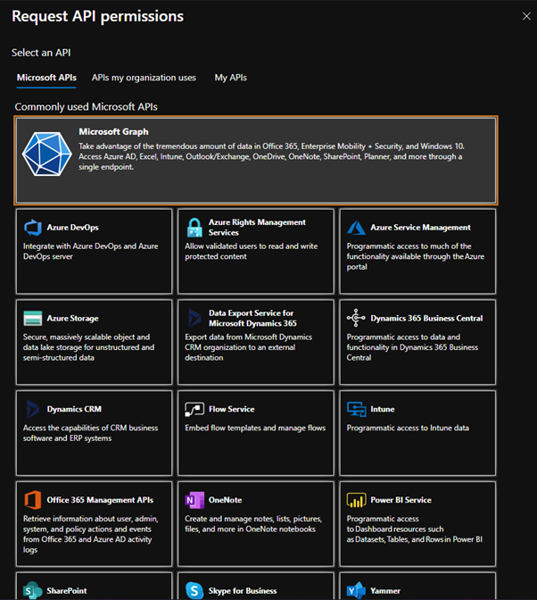
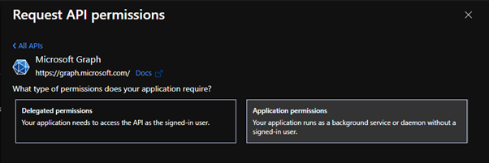
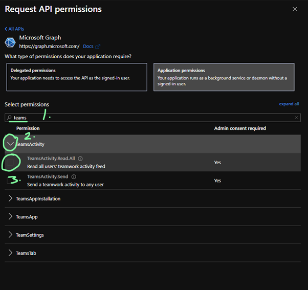
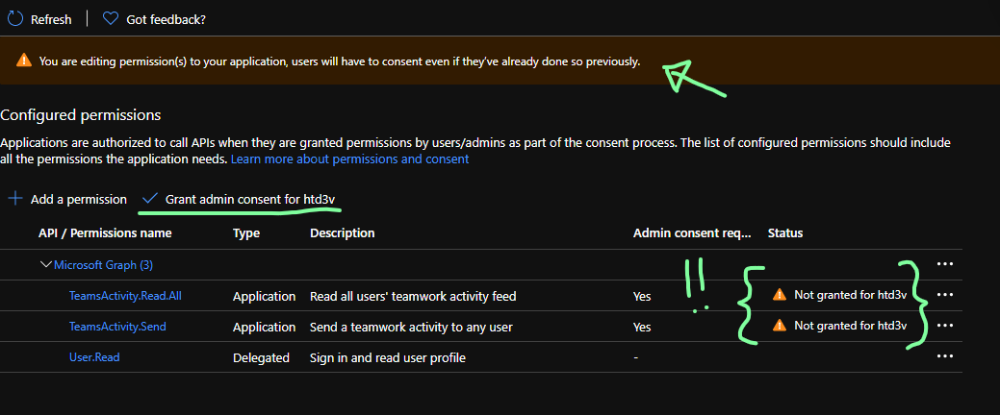
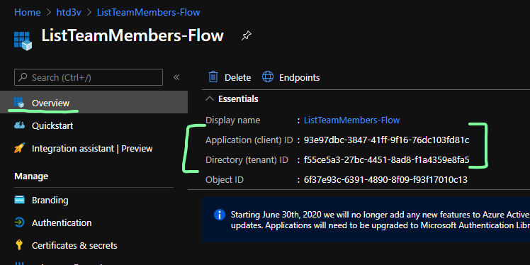
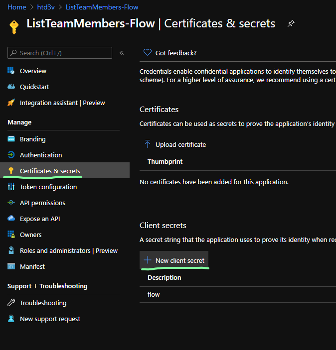
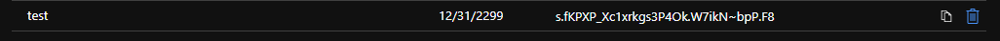

# Setting up an Azure AD Application

This is commonly used to gain access to Microsoft Graph to call all kinda of data from the Office 365 platform. They can also be granted permission to different API's and customised completely.

## Creating the Application

1. Browse to [portal.azure.com](https://portal.azure.com) to log into an account that has permissions to access / create Azure AD Applications.

2. Browse to Azure AD using the rail on the side, and click create application.

3. Name your application and continue.

4. To add the API permissions to use Graph select API Permissions, and select Permissions.

5. Select Microsoft Graph from the scope.

6. Select Application Permissions.

7. Search for the permission you want to add, select the tick button, and add.

8. Certain permissions may require your admin to approve as they have access to a large amount of organisation data. If so this popup will appear and this is what your admin would need to do.

9. You should find in the overview of your application you have a Tenant ID and Client ID. These will be used in the Flow to identify the application we have just made. 

10. Now we need to generate a secret to authenticate the Flow to access this application, and in turn Graph.

11. Generate a key, give it a description, and an expiry date which may be subject to hwo your organisation deals with data. Finally click add.

12. You should now see your new key generated. **Copy this now** and save it somewhere save, or in the Flow as it will only display once.

## Final Steps

You should now have a **Client ID**, a **Tenant ID**, and a **Secret** to authenticate all your Microsoft Graph calls.